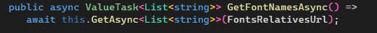

# PortfolioExampleAPI
This repository contains an example API I wrote as part of a Label Printer Application.

## Example API

### Example Code

> [!NOTE]
> XML comments require less bouncing betwee code defenitions to understand what is happening in the code.

### Example Broker Code

> [!NOTE]
> I use _"regions"_ to allow a developer to hide code that might distract them while they are working on code.

### Example Partial Class Method

